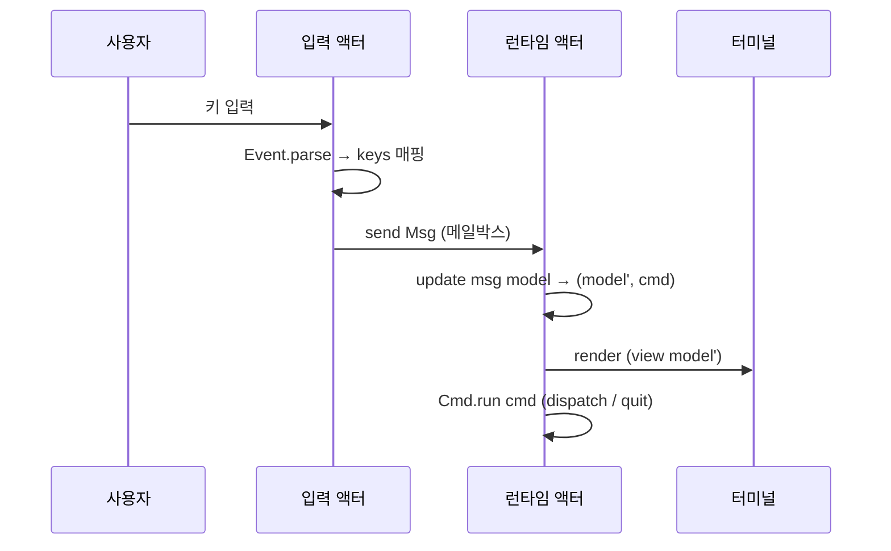
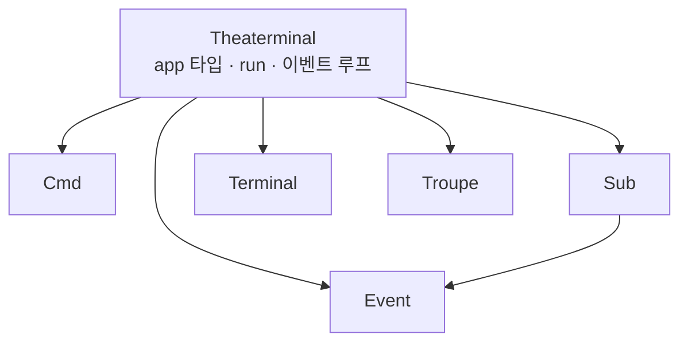

# Theaterminal 설계

Theaterminal은 [troupe](../../troupe) 액터 모델 위에 올린 **TEA(The Elm
Architecture) 기반 TUI 프레임워크**다. 애플리케이션은 순수한
`model`/`update`/`view`와 `subscriptions`만 정의하고, 프레임워크가 입력·렌더링·
이벤트 루프를 액터로 돌린다.

## 1. TEA 개념

TEA는 UI를 네 조각으로 나눈다.

- **model**: 애플리케이션의 전체 상태.
- **msg**: 상태를 바꾸는 사건(키 입력, 타이머 등).
- **update : msg -> model -> model \* cmd**: 메시지 하나를 받아 다음 상태와
  부수효과(`cmd`)를 만드는 순수 함수.
- **view : model -> string**: 현재 상태를 그릴 화면 한 프레임.

여기에 두 개의 부수효과 통로가 붙는다.

- **Cmd**: `update`가 런타임에 요청하는 부수효과. 후속 메시지를 되먹이거나
  (`msg`), 프로그램을 끝낸다(`quit`).
- **Sub**: 프로그램이 살아있는 동안 듣는 외부 메시지원(키보드 `keys`, 주기적
  타이머 `every`).

```
        ┌──────────────── Msg ────────────────┐
        │                                      │
   Sub ─┘                                      │
   (키/타이머)                                  │
        │                                      │
        ▼                                      │
   update(msg, model) ──▶ (model', cmd) ──▶ view(model') ──▶ 화면
                              │
                              └── Cmd (msg / quit)
```

## 2. 액터 매핑

troupe가 주는 것은 **fiber마다 하나의 메일박스**와 선택적 `receive`,
그리고 `await_readable` / `sleep`이다. Theaterminal은 이를 이렇게 쓴다.

- **런타임 액터**: `model`을 소유하고, 메일박스에서 `Msg`를 하나씩 꺼내
  `update → view → render`를 반복한다. 모든 메시지가 이 한 곳으로 모이므로
  상태 갱신은 자연히 직렬화된다(경쟁 없음).
- **입력 액터**: `await_readable(stdin)`으로 블록했다가, 읽은 바이트를
  `Event.parse`로 키로 변환해 `keys` 매핑을 거쳐 런타임 메일박스로 보낸다.
- **타이머 액터**: `sleep` 루프를 돌며 `every`의 메시지를 런타임으로 보낸다.

subscription 하나(leaf)당 액터 하나가 뜬다.

```mermaid
flowchart LR
  KB[키보드 / stdin] -->|바이트| IN[입력 액터]
  IN -->|Event.parse → keys → Msg| RT[런타임 액터<br/>model 소유]
  TM[타이머 액터] -->|every → Msg| RT
  RT -->|view : 프레임 문자열| TERM[Terminal.render]
  RT -. Cmd.msg .-> RT
  RT -. Cmd.quit .-> EXIT[터미널 복원 후 종료]
```

메시지 한 건이 처리되는 흐름:



## 3. 모듈 구성

각 모듈은 `.mli`만 읽어도 역할이 드러나도록 좁게 나눴다.



- **`Event`**: 키 타입과 터미널 바이트 디코더(`parse`). 순수 함수라 단위 테스트가
  쉽다.
- **`Terminal`**: raw 모드 전환, 대체 화면, 프레임 그리기. 유일한 저수준 I/O.
- **`Cmd`** / **`Sub`**: 추상 타입 + 조합자. 표현은 감추고, 런타임이 쓰는
  인터프리터(`Cmd.run`, `Sub.iter`)만 노출한다.
- **`Theaterminal`**: `app` 레코드 타입과 이벤트 루프(`run`, `run_headless`),
  그리고 위 모듈 재노출.

## 4. 종료 처리

troupe에는 취소(cancellation)가 없다. 입력 액터가 `await_readable`에 블록해 있으면
스케줄러의 `run`은 반환하지 않는다. 그래서 종료는 TUI 관례를 따른다.

- `Cmd.quit`가 나오면 런타임 루프를 멈추고 **터미널을 복원한 뒤 프로세스를
  종료**한다(`run`). 블록된 입력·타이머 액터는 프로세스와 함께 사라진다.
- `Terminal.setup`은 복원 함수를 `at_exit`에 등록하므로, 예외로 죽더라도 터미널
  상태는 되돌아온다.
- 테스트·임베딩용 `run_headless`는 터미널을 건드리지 않고, `quit` 시 루프에서
  **정상 반환**한다. subscription이 없으면 모든 액터가 idle이 되어 `Troupe.run`이
  스스로 끝나므로, 실제 tty 없이 루프 로직을 검증할 수 있다.

## 5. 현재의 단순화

MVP로서 의도적으로 좁힌 부분들.

- **정적 subscription**: `subscriptions`는 시작 시 한 번만 해석한다. model에 따라
  구독을 켜고 끄는 Elm식 동적 관리는 아직 없다.
- **diff 없는 전체 재그리기**: 매 프레임 전체를 다시 쓴다. 단, 화면을 지운 뒤
  그리지 않고 **제자리 덮어쓰기**(`ESC[H` → 줄마다 `ESC[K` → 끝에 `ESC[J`)를 쓰므로
  깜빡임은 없다. 바뀐 줄만 골라 쓰는 라인 단위 diff는 전송량을 줄이는 추가
  최적화로 아직 없다.
- **동기 Cmd**: `Cmd`는 후속 메시지·종료만 표현한다. 비동기 작업(예: 액터를
  띄워 결과를 되먹이는 `perform`)은 필요할 때 추가한다.
- **부분 이스케이프 시퀀스**: 두 번의 읽기에 걸쳐 쪼개진 ANSI 시퀀스는 재조립하지
  않는다.
