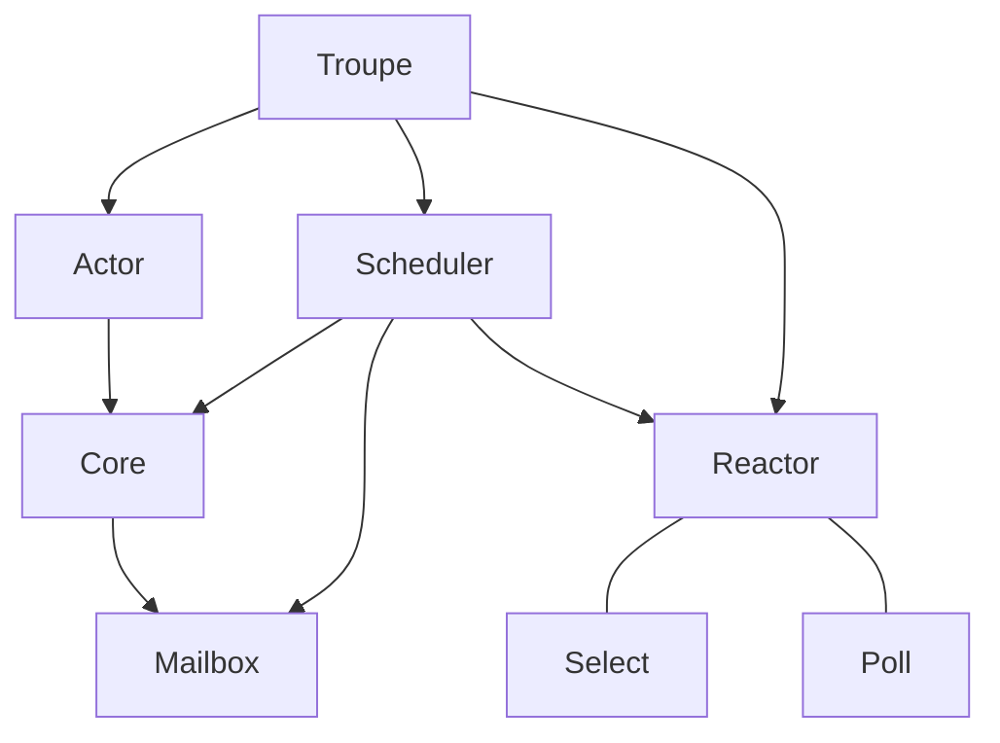
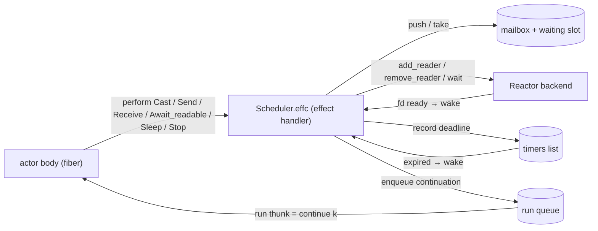
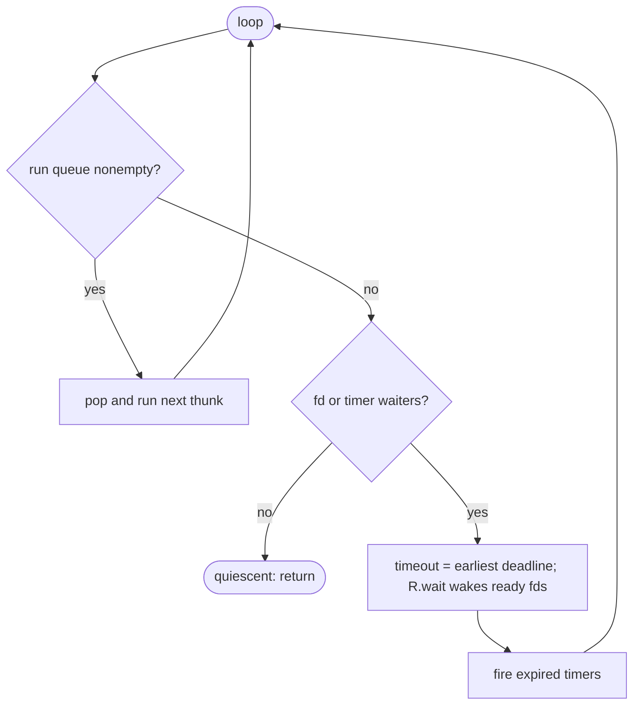
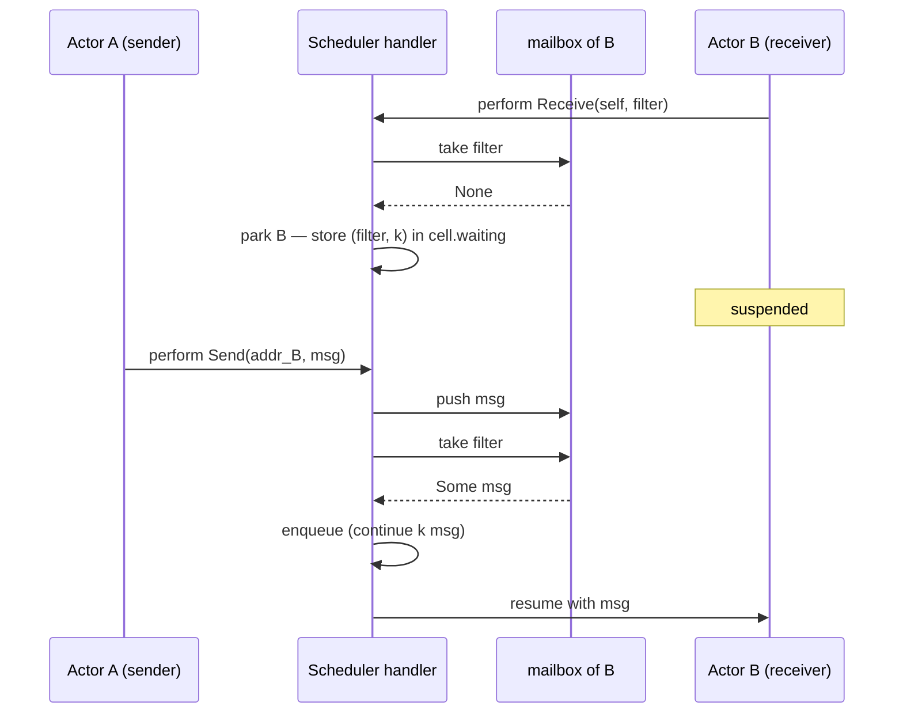

# Troupe — 설계 노트

Troupe는 대수적 효과(algebraic effects) 위에 구축한 OCaml 5용 소형 액터 모델
라이브러리입니다. 각 액터는 자신만의 파이버(fiber)로 실행되고, 전용 메일박스를
소유하며, 조건에 맞는 메시지가 도착할 때까지 *선택적 수신(selective receive)*
상태로 블록됩니다. 단일 스케줄러가 액터들이 수행(perform)하는 효과(`cast`,
`send`, `receive`, 그리고 I/O 대기)를 해석하므로, 액터 코드는 스케줄링에 대한
고민에서 자유롭습니다.

장기적인 목표는 이 액터 모델 위에 TUI 프레임워크 —
[The Elm Architecture](https://guide.elm-lang.org/architecture/) (TEA)에 대응하는
것 — 를 구축하는 것입니다. 이 의도가 아래 여러 결정에 영향을 주며, 그런 경우에는
명시적으로 언급했습니다.

이 문서는 라이브러리가 무엇인지, 그 바탕이 되는 원칙, 우리가 내린 결정과 그
이유, 우리가 받아들인 트레이드오프, 그리고 현재 상태를 기록합니다.

---

## 1. 설계 원칙

**제어 흐름에는 효과를, 오류에는 예외를.**
중단(suspension) — 메시지, fd, 타이머를 기다리는 것 — 은 효과로 표현합니다.
진짜 오류 상황은 예외로 남습니다. 액터는 중단 메커니즘을 결코 보지 못하며,
그저 `receive` / `await_readable` / `sleep`을 호출하고 블록되는 것처럼 보일
뿐입니다.

**효과는 도메인 로직이 아니라 런타임이 해석한다.**
세 개의 액터 동사와 두 개의 I/O 동사는 오직 `Effect.perform`만 할 뿐입니다.
모든 의미는 한 곳 — 스케줄러의 효과 핸들러 — 에 있습니다. 바로 이것이 액터
본문을 추론 가능할 만큼 순수하게 유지하고, 액터를 단 하나도 건드리지 않고
런타임을 교체할 수 있게 해 줍니다.

**계층적 설계: 소스는 중단하고, 하나의 핸들러가 해석한다.**
OCaml 5 효과 설계 지침에서 빌려 온 원칙입니다. 가장자리의 코드(예:
`await_readable`을 수행하는 액터)는 중단하고, 스케줄러는 어떻게 기다릴지(`Reactor`를
통해) 결정하며, 그 사이의 어떤 것도 블로킹에 대해 알 필요가 없습니다. 어떤 리액터
백엔드가 설치되어 있든 동일한 액터가 그대로 실행됩니다.

**교체 가능한 런타임.**
스케줄러는 `Reactor.S` 백엔드에 대한 펑터(functor)입니다. 액터를 향한 API는
백엔드에 완전히 무관하며, 오직 스케줄러의 핸들러만 리액터를 참조합니다.

---

## 2. 아키텍처

```
lib/
├── mailbox.mli/.ml   # FIFO queue with selective removal
├── core.ml           # shared cell type + private effects (internal, no .mli)
├── actor.mli/.ml     # self, body, Address, and the verbs (cast/send/receive/…)
├── reactor.mli/.ml   # module type S + Reactor.Select (Unix.select) / Reactor.Poll (iomux)
├── scheduler.mli/.ml # Scheduler.Make (R : Reactor.S) — the effect handler
└── troupe.mli/.ml    # re-exports Actor, Reactor, Scheduler + a default run
```

모듈 의존 관계(`Core`는 `.mli`가 없는 공유 기반이고, `Select` / `Poll`은 두
`Reactor.S` 백엔드입니다):



액터와 스케줄러가 모두 의존하는 요소 — `cell` 타입과 효과 생성자 — 는 `.mli`가
**없는** 내부 모듈 `Core`에 있습니다. 이렇게 하면 이 요소들이 `Actor`(효과를
수행하는 쪽)와 `Scheduler`(효과를 매칭하는 쪽)에게는 보이면서도, `Core` 자체는
결코 재노출(re-export)되지 않아 효과 생성자가 공개 API 밖에 머무릅니다. `Actor`와
`Scheduler`는 `Core` 위에 지은 두 개의 명명된 얼굴이고, `Troupe`는 이 둘(그리고
`Reactor`)을 재노출하며 기본 `run`을 제공하는 얇은 모듈입니다. `Mailbox`와
`Reactor`는 독립적으로 남습니다. 각각 자료 구조와 교체 가능한 백엔드로서, 저마다의
`.mli`를 가집니다.

### 공개 표면(public surface)

```ocaml
module Address : sig
  type 'msg t                                   (* shareable send handle *)
  val equal : 'a t -> 'b t -> bool
  val pp    : Format.formatter -> 'a t -> unit
end

type 'msg self                                  (* receive capability *)
type 'msg body = 'msg self -> unit

val cast    : 'msg body -> 'msg Address.t
val send    : 'msg Address.t -> 'msg -> unit
val receive : 'msg self -> ?matching:('msg -> bool) -> unit -> 'msg
val address : 'msg self -> 'msg Address.t

val await_readable : Unix.file_descr -> unit
val sleep          : float -> unit
val stop           : 'msg Address.t -> unit

module Reactor : ...                            (* re-exported: S, Select, Poll *)
module Scheduler : sig
  module Make (_ : Reactor.S) : sig val run : (unit -> unit) -> unit end
end
val run : (unit -> unit) -> unit                (* = Make (Reactor.Select).run *)
```

`Reactor`는 `Troupe`에서 재노출되므로, 외부 코드가 백엔드를 지정해 펑터를 적용할 수
있습니다. 예: `Troupe.Scheduler.Make (Troupe.Reactor.Poll)`.

### 효과(`Troupe` 내부용)

```ocaml
type _ Effect.t +=
  | Cast           : 'msg body -> 'msg cell Effect.t
  | Send           : 'msg cell * 'msg -> unit Effect.t
  | Receive        : 'msg cell * ('msg -> bool) -> 'msg Effect.t
  | Await_readable : Unix.file_descr -> unit Effect.t
  | Sleep          : float -> unit Effect.t
  | Stop           : 'msg cell -> unit Effect.t
```

이 생성자들은 노출되지 **않습니다**. 동사들이 이들을 `perform`하고, 스케줄러
핸들러가 이들을 매칭합니다. `Receive : 'msg cell * … -> 'msg Effect.t`가 타입
안전한 이유는 `cell`이 팬텀 타입 `'msg`를 실어 나르고, `send`의 타이핑이 메일박스에
오직 `'msg` 값만 담겼음을 보장하기 때문입니다.

### 스케줄러의 동작 방식

액터가 블록될 수 있는 모든 행위는 `perform`이며, 단일 효과 핸들러가 메일박스,
리액터, 타이머 목록, 실행 큐를 건드리는 유일한 존재입니다. 액터들은 서로를 직접
보지 못하고, 핸들러에서 만납니다:



`Scheduler.Make(R).run` 내부의 상태:

- **실행 큐(run queue)** — 재개할 준비가 된 썽크(`unit -> unit`), 타입이 소거됨.
- **액터별 메일박스 + `waiting` 슬롯** — `receive`에서 블록된 액터는 자신의
  `(filter, continuation)`을 자기 셀에 저장합니다.
- **fd 대기자(fd waiters)** — `fd → continuation`, 리액터에 등록됨.
- **타이머(timers)** — `(deadline, continuation) list`.

루프:

```
loop:
  run queue nonempty      -> pop and run the next thunk
  else fd/timer waiters?  -> timeout = earliest timer deadline (or None)
                             R.wait reactor ~timeout (wake ready fds)
                             fire expired timers
  else                    -> quiescent: return
```



`cast`는 메일박스와 `Address`를 새로 만들고 자식의 파이버를 큐에 넣습니다. `send`는
대상 메일박스에 밀어 넣고, 대상이 조건에 맞는 필터로 파킹되어 있으면 그 재개를 큐에
넣습니다. `receive`는 메일박스를 스캔하여, 적중 시 즉시 재개하고, 실패 시 파킹합니다.
보낼 수 있는 발신자가 없는 메시지에 파킹된 액터는 그저 영원히 기다립니다 — 그래도
루프는 종료됩니다. 오직 fd/타이머 대기자만이 루프를 살아 있게 하기 때문입니다.

`receive`와 `send` 뒤에 있는 파킹/깨우기 핸드셰이크 — B는 빈 메일박스에서 블록되고,
A의 `send`가 조건에 맞는 메시지를 전달하며 B를 다시 큐에 넣습니다:



---

## 3. 결정과 근거

### 액터당 파이버 + 선택적 수신 (리듀서가 아님)

초기 스케치는 동작을 리듀서 `state -> msg -> state`로 모델링했는데, 이는 TEA의
`update`에 깔끔하게 대응됩니다. 우리는 의도적으로 더 무거운 **액터당 파이버**
모델을 대신 선택했습니다. 각 액터는 자신의 루프를 돌리며 `receive`를 호출하는 실제
계산이고, 여기에는 *선택적* 수신(Erlang의 "save queue" 의미론 — 조건에 맞는 첫
메시지를 취하고 나머지는 순서대로 남겨 둠)도 포함됩니다.

더 무거운 쪽을 택한 이유: 이 프로젝트는 학습용이고, 효과 위에서의 선택적 수신이
만들어 볼 만한 흥미로운 핵심이기 때문입니다. 리듀서 스타일은 여전히 *그 위에*
표현할 수 있으므로(수신하고 접는 루프), 향후 TEA 계층을 위해 잃는 것은 없습니다.

### `self` 대 `Address` — 능력(capability)의 분리

누구든 `Address`를 쥐고 액터에게 `send`할 수 있지만, 액터 자신만이 `self`를 받고,
오직 `self`만이 `receive`할 수 있습니다. 둘은 같은 런타임 `cell`을 두 개의 추상
타입으로 노출한 것이므로, 이 분리는 런타임 비용이 전혀 없으면서 "누구나 나에게
보낼 수 있지만, 내 메일박스는 나만 읽을 수 있다"를 타입 수준의 보장으로 만듭니다.
`address : 'msg self -> 'msg Address.t`가 그 일방향 문입니다.

### 명명: `Address`, `cast`, `perform`

우리는 Erlang의 *구조*는 따르되 그 명명은 따르지 않습니다. 이 라이브러리는 연극
*troupe(극단)*를 테마로 하므로, 이름은 은어보다는 문자적이면서도 함축적인 쪽으로
기울입니다:

- **`Address`** (`Pid`/`Ref` 대신) — 메시지를 보내는 곳이며, `Ref`는 OCaml의
  `ref`와도 충돌합니다.
- **`cast`** (`spawn` 대신) — 액터를 극단으로 *배역 결정(cast)*합니다.
- **`perform`** (궁극의 `run` 계열 동사 테마) — 효과의 어휘와 무대 은유 양쪽에
  모두 들어맞습니다.

`send`와 `receive`는 문자 그대로 유지합니다 — 핵심적이고 보편적으로 이해되기
때문입니다.

### 모듈 배치: 내부 `Core`, 그다음 `Actor` / `Scheduler` / `Troupe`

런타임은 `Address`, `self`, 스케줄러가 함께 쓰는 하나의 공유 `cell` 타입 위에
얹혀 있고, 스케줄러는 효과 생성자를 패턴 매칭해야 합니다. 순진한 분리 — 각자
`.mli`를 가진 `actor.ml`과 `scheduler.ml` — 는 모듈 시스템과 부딪힙니다. 공유 `cell`은
추상 타입 강제 변환이나 재귀 모듈을 필요로 하고, 효과 생성자는 두 파일이 모두 볼 수
있도록 공개 `.mli`를 통해 새어 나가야 하기 때문입니다.

초기 반복(iteration)에서는 엔진 전체를 한 모듈에 넣어 이 문제를 피했습니다. 이후
`Actor`와 `Scheduler`를 명명된 개념으로 만들기 위해 다시 분리하면서, 이 둘이 반드시
공유해야 하는 딱 두 가지 — `cell` 타입과 효과 생성자 — 만 담는 **`.mli` 없는
`Core`**를 사용했습니다. `Core`는 인터페이스가 없으므로 형제 모듈에게는 보이지만
`Troupe`에서 재노출되지 않아, 어떤 강제 변환 곡예도 없이 효과가 비공개로 유지됩니다.
`Actor`는 액터를 향한 API를, `Scheduler`는 핸들러를 노출하고, `Troupe`는 변하지 않는
공개 표면 뒤에서 둘 다 재노출합니다. `Mailbox`와 `Reactor`는 진정으로 독립적이므로
분리된 채로 둡니다.

### 기본값으로서의 `Unix.select`, 그 곁의 `Reactor.Poll`

I/O 준비 상태(readiness)의 기본값은 표준 라이브러리 **`Unix.select`**
(`Reactor.Select`)이며, `Scheduler.Make`가 소비하는 `Reactor.S` 시그니처 뒤에
있습니다. 두 번째 백엔드인 **`Reactor.Poll`** — `poll(2)` 위에(`iomux` 라이브러리를
통해) — 가 그 곁에 함께 제공됩니다. 근거:

- **io_uring** (Eio의 `eio_linux` 백엔드)는 보안 이슈의 이력이 있고 일부 강화된
  환경에서는 비활성화되어 있습니다.
- **epoll**은 Linux 전용이라 macOS에는 존재하지 않습니다(우리의 개발 플랫폼은
  Darwin이고, 거기서의 커널 대응물은 `kqueue`입니다). epoll 리액터는 로컬에서
  실행조차 할 수 없습니다.
- **`iomux`**는 현재 `poll(2)`/`ppoll(2)`만 구현합니다(epoll/kqueue는 명시된
  목표일 뿐 아직 미구현). `poll(2)` 자체가 이식성이 있고(Linux/macOS/BSD) `select`의
  디스크립터 개수 제한이 없으므로, `Reactor.Poll`은 `Select`가 도는 모든 곳에서
  동작합니다.
- TUI 규모 — 디스크립터 한두 개(stdin, 어쩌면 시그널 파이프) — 에서는 `select`가
  무엇 못지않게 빠르고 의존성도 없으므로, 기본값으로 남습니다.

펑터 덕분에 이 작업이 저렴했습니다. `Reactor.Poll`은 스케줄러나 어떤 액터도 바꾸지
않고 `Reactor.S` 뒤에 그대로 끼워 넣어졌으며, 동일한 테스트가 둘 다에 대해
실행됩니다. 향후 `epoll`/`kqueue` 백엔드도 같은 방식으로 도착할 것입니다.

### fd 준비 상태는 리액터가, 타이머는 스케줄러가 소유한다

`Reactor.S`는 `add_reader` / `remove_reader` / `wait ~timeout`으로 좁게
유지됩니다. 타이머 힙은 스케줄러에 있으며, 스케줄러는 계산된 타임아웃을 `wait`에
그저 넘겨줄 뿐입니다. 이렇게 하면 백엔드 시그니처가 작게 유지되어, 향후 백엔드가
구현해야 할 것이 아주 적어집니다.

### 취소(`stop`): `alive` 플래그 + continuation 폐기

`stop addr`은 park 상태든 실행 대기 상태든 액터를 취소합니다. 스케줄러는 park된
continuation을 밖에서 되살릴 수 없으므로, 취소는 **continuation을 되살리지 않고 버리는**
방식입니다.

- 셀에 `mutable alive` 플래그를 둡니다. 모든 재개(resume)는 실행 큐에 넣기 전이 아니라
  **실행되는 순간** 이 플래그를 확인해, 죽은 액터면 `continue`를 건너뛰고 continuation을
  버립니다. 이로써 이미 큐에 들어간 재개(타이머가 막 발화한 경우 등)도 안전하게 무효화됩니다.
- 액터별 핸들러가 자기 셀을 클로저로 잡으므로, park 시점에 소유자를 압니다. `fd_waiters`와
  타이머 항목은 소유 셀을 타입 소거(`Packed`)해 함께 들고 있습니다.
- `stop`은 `alive <- false` 후, 그 셀의 `receive` continuation(있으면)을 비우고,
  **타이머 큐에서 그 셀의 항목을 제거**하며, `fd_waiters`를 훑어 그 셀이 기다리던 fd를
  찾아 `remove_reader`합니다. 덕분에 취소된 타이머·fd 대기가 스케줄러의 유휴 판정을 막지
  않아, `run`이 정상적으로 끝납니다.

이것이 상위 TEA 계층의 **동적 구독**을 떠받칩니다: 모델이 바뀌어 어떤 구독이 사라지면,
`sleep`에 park된 타이머 액터를 즉시 멈출 수 있습니다.

### 범위: 리액터는 미뤘다가, 실제 소비자와 함께 만들었다

액터 코어는 I/O **없이** 먼저 만들어졌습니다 — `cast`/`send`/`receive`와
정지 상태까지의 실행(run-to-quiescence)에는 I/O가 필요 없습니다. 리액터는 투기적으로
만들지 않고, 진짜 소비자(파이프와 타이머를 구동하는 테스트)를 줄 수 있게 되었을 때
비로소 추가했습니다. `await_readable`(stdin)과 `sleep`(틱 구독)을 실제로 소비할
TUI 계층이 그다음 그런 단계입니다.

---

## 4. 트레이드오프와 알려진 한계

- **단일 스레드, 협력적(cooperative).** 하나의 도메인이며, 액터들은
  `receive`/`await_readable`/`sleep` 지점에서 교차 실행됩니다. 병렬성도, 선점도
  없습니다. 결코 중단하지 않는 CPU 바운드 액터는 나머지를 굶깁니다(`yield` 탈출구를
  고려했으나, 무언가 필요로 할 때까지 의도적으로 배제했습니다).
- **리액터는 읽기 준비 상태만 감시하며, fd당 대기자는 하나.** 쓰기 준비 상태도,
  디스크립터당 여러 액터도 없습니다. TUI에는 둘 다 필요 없으며, 둘 다 기존 인터페이스
  뒤에서 깔끔하게 확장됩니다.
- **타이머는 정렬되지 않은 리스트**로, 유휴 틱마다 스캔됩니다 — 소수에는 괜찮지만
  수천 개에는 아닙니다. 필요해지면 힙으로 교체하면 됩니다.
- **메일박스 `take`는 선택적 수신마다 O(n)**입니다(큐를 다시 만듭니다). 작은
  메일박스에는 허용 가능합니다.
- **아직 감독/재시작 전략 없음.** 액터에서 잡히지 않은 예외는 핸들러의 `exnc`를
  통해 스케줄러 밖으로 전파됩니다.
- **`select`의 `FD_SETSIZE` 제한**(~1024)은 기본 백엔드에 적용되지만, 우리가
  겨냥하는 디스크립터 개수에서는 무관합니다. `Reactor.Poll`에는 그런 제한이 없습니다.
- **타이머 해상도는 백엔드마다 다름.** `Reactor.Select`는 부동소수 초 단위
  타임아웃을 받고, `Reactor.Poll`은 정수 밀리초(`poll(2)`)를 받으므로 거기서는
  `sleep`이 다음 밀리초로 올림됩니다. 틱 구독에는 무관하며, 밀리초 미만 타이머는
  `ppoll`이 필요합니다(iomux가 macOS에서 이를 에뮬레이션합니다. Darwin에는 진짜
  `ppoll`이 없기 때문입니다).

---

## 5. 현재 상태

구현 및 테스트 완료(`dune build`, `dune test`):

- FIFO와 선택적 제거를 갖춘 메일박스.
- 액터당 파이버 스케줄러: `cast`, `send`, 선택적 `receive`, 파킹/깨우기,
  정지 상태까지의 실행.
- 두 백엔드를 갖춘 `Reactor.S` — `Reactor.Select`(기본)와 `Reactor.Poll`(iomux);
  `Scheduler.Make` 펑터; 소비자가 백엔드를 고를 수 있도록 재노출된 `Reactor`;
  Select 기반 기본값인 `run`.
- I/O 대기: `await_readable`(리액터에 파킹되어 준비 시 깨어남)과 `sleep`(타이머가
  마감 순서대로 발화).

테스트 커버리지(`test/test_troupe.ml`): 카운터/FIFO 순서, 선택적 수신, 반환된
주소를 통한 요청/응답, 파킹 후 깨우기, 그리고 — *두* 리액터 백엔드 모두에 대해
실행 — Unix 파이프 위에서의 `await_readable`과 타이머 순서.

툴체인: OCaml ≥ 5.1, dune, `iomux`. 기여자 설정은
`opam install . --deps-only --with-test`입니다(`alcotest`도 함께 받습니다).

---

## 6. 로드맵

- Troupe 위의 **TUI / TEA 계층**: `view`, 렌더 액터, 그리고 `await_readable`로
  stdin을 읽는 입력 소스 액터; `sleep`하고 틱을 방출하는 액터로서의 구독.
- 디스크립터 개수가 정당화한다면, 기존 `Reactor.S` 뒤의 **추가 리액터
  백엔드**(`epoll`/`kqueue`). (iomux를 통한 `poll`은 완료됨 — §5 참조.)
- 소비자가 필요로 한다면 **쓰기 준비 상태**와 fd당 여러 대기자.
- **감독(supervision)** — 실패하는 액터를 위한 재시작 전략.
- **`yield`** — 실제 CPU 바운드 워크로드가 나타날 때만.
